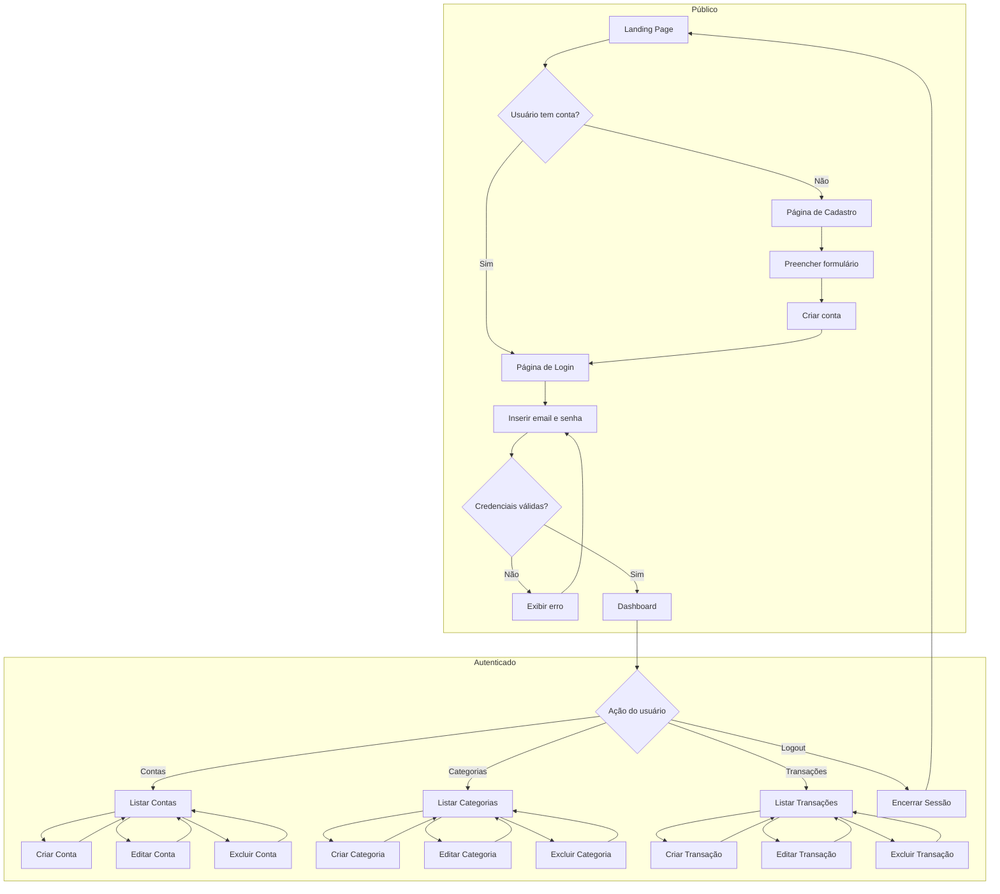
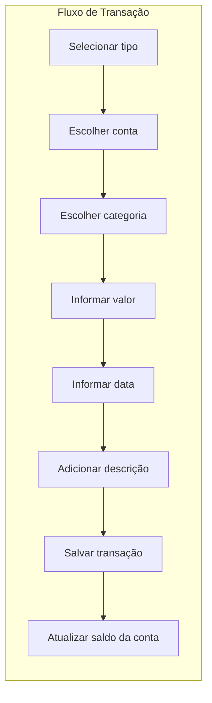
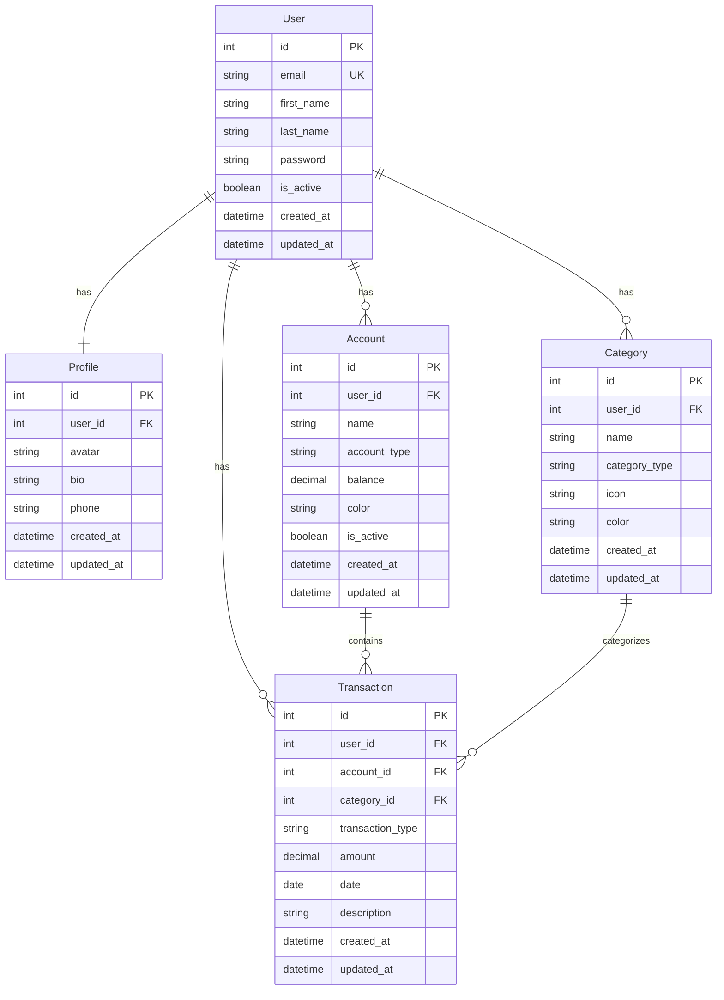

# Finanpy - Product Requirement Document (PRD)

> Sistema de Gestão de Finanças Pessoais

**Versão:** 1.0  
**Data:** 28 de Janeiro de 2026  
**Status:** Em Desenvolvimento

---

## Índice

1. [Visão Geral](#1-visão-geral)
2. [Sobre o Produto](#2-sobre-o-produto)
3. [Propósito](#3-propósito)
4. [Público Alvo](#4-público-alvo)
5. [Objetivos](#5-objetivos)
6. [Requisitos Funcionais](#6-requisitos-funcionais)
7. [Requisitos Não-Funcionais](#7-requisitos-não-funcionais)
8. [Arquitetura Técnica](#8-arquitetura-técnica)
9. [Design System](#9-design-system)
10. [User Stories](#10-user-stories)
11. [Métricas de Sucesso](#11-métricas-de-sucesso)
12. [Riscos e Mitigações](#12-riscos-e-mitigações)
13. [Lista de Tarefas](TASKS.md)

---

## 1. Visão Geral

O **Finanpy** é um sistema web de gestão de finanças pessoais desenvolvido com Python e Django. O sistema permite que usuários controlem suas contas bancárias, categorizem suas transações financeiras (entradas e saídas) e visualizem um dashboard com resumo de suas finanças.

O projeto segue uma arquitetura simples e pragmática, utilizando Django full-stack com templates nativos (Django Template Language) estilizados com TailwindCSS, banco de dados SQLite e o sistema de autenticação nativo do Django.

---

## 2. Sobre o Produto

O Finanpy é uma aplicação web monolítica construída com Django, focada em simplicidade e eficiência. O sistema oferece:

- **Autenticação por email**: Login utilizando email ao invés de username
- **Gestão de contas bancárias**: Cadastro e controle de múltiplas contas
- **Categorização de transações**: Organização de receitas e despesas por categorias
- **Dashboard financeiro**: Visualização consolidada das finanças pessoais
- **Interface moderna**: Design responsivo com tema escuro e gradientes

### Características Principais

| Característica | Descrição |
|----------------|-----------|

| **Plataforma** | Web (responsivo para desktop e mobile) |
| **Idioma da Interface** | Português Brasileiro |
| **Idioma do Código** | Inglês |
| **Banco de Dados** | SQLite |
| **Autenticação** | Sistema nativo do Django com login por email |

---

## 3. Propósito

O propósito do Finanpy é fornecer uma ferramenta simples e eficiente para que indivíduos possam:

1. **Organizar suas finanças pessoais** de forma centralizada
2. **Acompanhar entradas e saídas** de dinheiro em diferentes contas
3. **Categorizar transações** para melhor entendimento dos gastos
4. **Visualizar resumos financeiros** através de um dashboard intuitivo
5. **Tomar decisões financeiras** baseadas em dados consolidados

---

## 4. Público Alvo

### Perfil Primário

- **Pessoas físicas** que desejam controlar suas finanças pessoais
- **Idade**: 18 a 60 anos
- **Perfil tecnológico**: Usuários com conhecimento básico de internet
- **Necessidade**: Organização financeira sem complexidade

### Características do Usuário

| Aspecto | Descrição |
|---------|-----------|
| **Motivação** | Controlar gastos e receitas de forma simples |
| **Dor** | Falta de visibilidade sobre onde o dinheiro está sendo gasto |
| **Expectativa** | Interface intuitiva e rápida para registrar transações |
| **Frequência de uso** | Diária a semanal |

---

## 5. Objetivos

### 5.1 Objetivos de Negócio

1. Criar uma aplicação funcional de gestão financeira pessoal
2. Demonstrar boas práticas de desenvolvimento com Django
3. Entregar um MVP (Minimum Viable Product) completo e utilizável

### 5.2 Objetivos Técnicos

1. Implementar arquitetura modular com apps Django separados
2. Utilizar Class Based Views sempre que possível
3. Seguir padrões PEP08 e boas práticas Python
4. Criar interface responsiva com TailwindCSS
5. Implementar autenticação segura com login por email

### 5.3 Objetivos de Usuário

1. Registrar e gerenciar contas bancárias
2. Cadastrar transações de entrada e saída
3. Categorizar transações para análise
4. Visualizar resumo financeiro no dashboard
5. Acessar o sistema de qualquer dispositivo

---

## 6. Requisitos Funcionais

### 6.1 Módulo de Autenticação (RF-AUTH)

| ID | Requisito | Descrição |
|----|-----------|-----------|
| RF-AUTH-01 | Cadastro de usuário | O sistema deve permitir o cadastro de novos usuários com nome, email e senha |
| RF-AUTH-02 | Login por email | O sistema deve autenticar usuários utilizando email e senha |
| RF-AUTH-03 | Logout | O sistema deve permitir que o usuário encerre sua sessão |
| RF-AUTH-04 | Proteção de rotas | Páginas internas devem ser acessíveis apenas para usuários autenticados |

### 6.2 Módulo de Contas Bancárias (RF-ACC)

| ID | Requisito | Descrição |
|----|-----------|-----------|
| RF-ACC-01 | Criar conta | O usuário deve poder cadastrar uma nova conta bancária |
| RF-ACC-02 | Listar contas | O usuário deve visualizar todas as suas contas cadastradas |
| RF-ACC-03 | Editar conta | O usuário deve poder alterar os dados de uma conta |
| RF-ACC-04 | Excluir conta | O usuário deve poder remover uma conta do sistema |
| RF-ACC-05 | Saldo da conta | O sistema deve calcular e exibir o saldo atual de cada conta |

### 6.3 Módulo de Categorias (RF-CAT)

| ID | Requisito | Descrição |
|----|-----------|-----------|
| RF-CAT-01 | Criar categoria | O usuário deve poder cadastrar categorias para transações |
| RF-CAT-02 | Listar categorias | O usuário deve visualizar todas as suas categorias |
| RF-CAT-03 | Editar categoria | O usuário deve poder alterar os dados de uma categoria |
| RF-CAT-04 | Excluir categoria | O usuário deve poder remover uma categoria |
| RF-CAT-05 | Tipo de categoria | Categorias devem ser classificadas como receita ou despesa |

### 6.4 Módulo de Transações (RF-TRX)

| ID | Requisito | Descrição |
|----|-----------|-----------|
| RF-TRX-01 | Criar transação | O usuário deve poder registrar uma nova transação |
| RF-TRX-02 | Listar transações | O usuário deve visualizar suas transações com filtros |
| RF-TRX-03 | Editar transação | O usuário deve poder alterar os dados de uma transação |
| RF-TRX-04 | Excluir transação | O usuário deve poder remover uma transação |
| RF-TRX-05 | Vincular conta | Transações devem estar vinculadas a uma conta bancária |
| RF-TRX-06 | Vincular categoria | Transações devem estar vinculadas a uma categoria |

### 6.5 Módulo de Dashboard (RF-DASH)

| ID | Requisito | Descrição |
|----|-----------|-----------|
| RF-DASH-01 | Resumo financeiro | Exibir saldo total, receitas e despesas do período |
| RF-DASH-02 | Últimas transações | Listar as transações mais recentes |
| RF-DASH-03 | Saldo por conta | Exibir o saldo de cada conta cadastrada |

### 6.6 Página Pública (RF-PUB)

| ID | Requisito | Descrição |
|----|-----------|-----------|
| RF-PUB-01 | Landing page | Página inicial pública com apresentação do sistema |
| RF-PUB-02 | Link para cadastro | Botão/link para página de registro |
| RF-PUB-03 | Link para login | Botão/link para página de login |

### 6.7 Módulo de Perfil (RF-PROF)

| ID | Requisito | Descrição |
|----|-----------|-----------|
| RF-PROF-01 | Visualizar perfil | O usuário deve poder visualizar seus dados cadastrais |
| RF-PROF-02 | Editar perfil | O usuário deve poder alterar seu nome, avatar e informações complementares |

### 6.8 Flowchart - Fluxos de UX





---

## 7. Requisitos Não-Funcionais

### 7.1 Usabilidade (RNF-USA)

| ID | Requisito | Descrição |
|----|-----------|-----------|
| RNF-USA-01 | Responsividade | Interface deve funcionar em desktop, tablet e mobile |
| RNF-USA-02 | Idioma | Toda interface deve estar em português brasileiro |
| RNF-USA-03 | Feedback visual | Ações do usuário devem ter feedback imediato |
| RNF-USA-04 | Navegação intuitiva | Menu de navegação claro e acessível |

### 7.2 Segurança (RNF-SEG)

| ID | Requisito | Descrição |
|----|-----------|-----------|
| RNF-SEG-01 | Autenticação | Senhas devem ser armazenadas com hash seguro |
| RNF-SEG-02 | Autorização | Usuários só podem acessar seus próprios dados |
| RNF-SEG-03 | CSRF | Proteção contra ataques CSRF em todos os formulários |
| RNF-SEG-04 | Sessão | Sessões devem expirar após período de inatividade |

### 7.3 Manutenibilidade (RNF-MAN)

| ID | Requisito | Descrição |
|----|-----------|-----------|
| RNF-MAN-01 | Código limpo | Seguir padrões PEP08 |
| RNF-MAN-02 | Modularidade | Separação de responsabilidades em apps Django |
| RNF-MAN-03 | Documentação | Código documentado quando necessário |
| RNF-MAN-04 | Versionamento | Uso de Git para controle de versão |

### 7.4 Performance (RNF-PER)

| ID | Requisito | Descrição |
|----|-----------|-----------|
| RNF-PER-01 | Tempo de resposta | Páginas devem carregar em menos de 3 segundos |
| RNF-PER-02 | Banco de dados | Queries otimizadas com select_related/prefetch_related |

---

## 8. Arquitetura Técnica

### 8.1 Stack Tecnológica

| Camada | Tecnologia | Versão |
|--------|------------|--------|
| **Backend** | Python | 3.12+ |
| **Framework** | Django | 6.0+ |
| **Banco de Dados** | SQLite | 3 |
| **Frontend** | Django Template Language | - |
| **CSS Framework** | TailwindCSS | 3.x |
| **Servidor de Desenvolvimento** | Django Development Server | - |

### 8.2 Estrutura de Diretórios

```
finanpy/
├── core/                   # Configurações globais do projeto
│   ├── __init__.py
│   ├── asgi.py
│   ├── settings.py
│   ├── urls.py
│   └── wsgi.py
├── users/                  # App de usuários
│   ├── __init__.py
│   ├── admin.py
│   ├── apps.py
│   ├── forms.py
│   ├── models.py
│   ├── urls.py
│   └── views.py
├── profiles/               # App de perfis
│   ├── __init__.py
│   ├── admin.py
│   ├── apps.py
│   ├── forms.py
│   ├── models.py
│   ├── tests.py
│   ├── urls.py
│   └── views.py
├── accounts/               # App de contas bancárias
│   ├── __init__.py
│   ├── admin.py
│   ├── apps.py
│   ├── forms.py
│   ├── models.py
│   ├── urls.py
│   └── views.py
├── categories/             # App de categorias
│   ├── __init__.py
│   ├── admin.py
│   ├── apps.py
│   ├── forms.py
│   ├── models.py
│   ├── urls.py
│   └── views.py
├── transactions/           # App de transações
│   ├── __init__.py
│   ├── admin.py
│   ├── apps.py
│   ├── forms.py
│   ├── models.py
│   ├── urls.py
│   └── views.py
├── templates/              # Templates globais
│   ├── base.html
│   ├── components/
│   │   ├── navbar.html
│   │   ├── sidebar.html
│   │   ├── card.html
│   │   ├── form.html
│   │   ├── button.html
│   │   └── table.html
│   ├── public/
│   │   └── landing.html
│   └── dashboard/
│       └── index.html
├── static/                 # Arquivos estáticos
│   ├── css/
│   │   └── output.css
│   └── js/
│       └── main.js
├── db.sqlite3
├── manage.py
├── requirements.txt
├── tailwind.config.js
└── package.json
```

### 8.3 Estrutura de Dados (Schema)



### 8.4 Descrição dos Models

#### Profile (profiles/models.py)

```python
class Profile(models.Model):
    user = models.OneToOneField(User, on_delete=models.CASCADE)
    avatar = models.ImageField(upload_to='avatars/', blank=True, null=True)
    bio = models.TextField(max_length=500, blank=True)
    phone = models.CharField(max_length=20, blank=True)
    created_at = models.DateTimeField(auto_now_add=True)
    updated_at = models.DateTimeField(auto_now=True)
```

#### User (users/models.py)

```python
class User(AbstractUser):
    username = None
    email = models.EmailField(unique=True)
    created_at = models.DateTimeField(auto_now_add=True)
    updated_at = models.DateTimeField(auto_now=True)
    
    USERNAME_FIELD = 'email'
    REQUIRED_FIELDS = []
```

#### Account (accounts/models.py)

```python
class Account(models.Model):
    ACCOUNT_TYPES = [
        ('checking', 'Conta Corrente'),
        ('savings', 'Poupança'),
        ('investment', 'Investimento'),
        ('cash', 'Dinheiro'),
        ('other', 'Outro'),
    ]
    
    user = models.ForeignKey(User, on_delete=models.CASCADE)
    name = models.CharField(max_length=100)
    account_type = models.CharField(max_length=20, choices=ACCOUNT_TYPES)
    balance = models.DecimalField(max_digits=12, decimal_places=2, default=0)
    color = models.CharField(max_length=7, default='#06b6d4')
    is_active = models.BooleanField(default=True)
    created_at = models.DateTimeField(auto_now_add=True)
    updated_at = models.DateTimeField(auto_now=True)
```

#### Category (categories/models.py)

```python
class Category(models.Model):
    CATEGORY_TYPES = [
        ('income', 'Receita'),
        ('expense', 'Despesa'),
    ]
    
    user = models.ForeignKey(User, on_delete=models.CASCADE)
    name = models.CharField(max_length=100)
    category_type = models.CharField(max_length=10, choices=CATEGORY_TYPES)
    icon = models.CharField(max_length=50, blank=True)
    color = models.CharField(max_length=7, default='#06b6d4')
    created_at = models.DateTimeField(auto_now_add=True)
    updated_at = models.DateTimeField(auto_now=True)
```

#### Transaction (transactions/models.py)

```python
class Transaction(models.Model):
    TRANSACTION_TYPES = [
        ('income', 'Receita'),
        ('expense', 'Despesa'),
    ]
    
    user = models.ForeignKey(User, on_delete=models.CASCADE)
    account = models.ForeignKey(Account, on_delete=models.CASCADE)
    category = models.ForeignKey(Category, on_delete=models.SET_NULL, null=True)
    transaction_type = models.CharField(max_length=10, choices=TRANSACTION_TYPES)
    amount = models.DecimalField(max_digits=12, decimal_places=2)
    date = models.DateField()
    description = models.CharField(max_length=255, blank=True)
    created_at = models.DateTimeField(auto_now_add=True)
    updated_at = models.DateTimeField(auto_now=True)
```

---

## 9. Design System

### 9.1 Paleta de Cores

O sistema utiliza uma paleta baseada em **Cyan** e **Emerald** sobre fundo escuro.

#### Cores Principais

| Nome | Classe TailwindCSS | Hex | Uso |
|------|-------------------|-----|-----|
| **Primary** | `cyan-500` | #06b6d4 | Botões principais, links, destaques |
| **Primary Hover** | `cyan-600` | #0891b2 | Hover de elementos primários |
| **Primary Light** | `cyan-400` | #22d3ee | Ícones, bordas de destaque |
| **Secondary** | `emerald-500` | #10b981 | Receitas, valores positivos, sucesso |
| **Secondary Hover** | `emerald-600` | #059669 | Hover de elementos secundários |
| **Danger** | `red-500` | #ef4444 | Despesas, valores negativos, erros |
| **Danger Hover** | `red-600` | #dc2626 | Hover de elementos de perigo |
| **Warning** | `amber-500` | #f59e0b | Alertas, avisos |

#### Cores de Fundo

| Nome | Classe TailwindCSS | Hex | Uso |
|------|-------------------|-----|-----|
| **Background** | `gray-950` | #030712 | Fundo principal da aplicação |
| **Surface** | `gray-900` | #111827 | Cards, modais, sidebar |
| **Surface Light** | `gray-800` | #1f2937 | Hover de cards, inputs |
| **Border** | `gray-700` | #374151 | Bordas de elementos |

#### Cores de Texto

| Nome | Classe TailwindCSS | Hex | Uso |
|------|-------------------|-----|-----|
| **Text Primary** | `gray-100` | #f3f4f6 | Texto principal |
| **Text Secondary** | `gray-400` | #9ca3af | Texto secundário, labels |
| **Text Muted** | `gray-500` | #6b7280 | Texto desabilitado |

#### Gradientes

```html
<!-- Gradiente principal (cyan para emerald) -->
<div class="bg-gradient-to-r from-cyan-500 to-emerald-500">

<!-- Gradiente de fundo sutil -->
<div class="bg-gradient-to-br from-gray-900 via-gray-950 to-gray-900">

<!-- Gradiente para cards de destaque -->
<div class="bg-gradient-to-br from-cyan-500/10 to-emerald-500/10">
```

### 9.2 Tipografia

| Elemento | Classes TailwindCSS |
|----------|---------------------|
| **Font Family** | `font-sans` (Inter ou system-ui) |
| **Heading 1** | `text-3xl font-bold text-gray-100` |
| **Heading 2** | `text-2xl font-semibold text-gray-100` |
| **Heading 3** | `text-xl font-semibold text-gray-100` |
| **Heading 4** | `text-lg font-medium text-gray-100` |
| **Body** | `text-base text-gray-300` |
| **Small** | `text-sm text-gray-400` |
| **Caption** | `text-xs text-gray-500` |

### 9.3 Componentes

#### Botões

```html
<!-- Botão Primário -->
<button class="px-4 py-2 bg-cyan-500 hover:bg-cyan-600 text-white font-medium rounded-lg transition-colors duration-200 focus:outline-none focus:ring-2 focus:ring-cyan-500 focus:ring-offset-2 focus:ring-offset-gray-900">
    Salvar
</button>

<!-- Botão Secundário -->
<button class="px-4 py-2 bg-gray-700 hover:bg-gray-600 text-gray-100 font-medium rounded-lg transition-colors duration-200 focus:outline-none focus:ring-2 focus:ring-gray-500 focus:ring-offset-2 focus:ring-offset-gray-900">
    Cancelar
</button>

<!-- Botão Outline -->
<button class="px-4 py-2 border border-cyan-500 text-cyan-500 hover:bg-cyan-500 hover:text-white font-medium rounded-lg transition-colors duration-200 focus:outline-none focus:ring-2 focus:ring-cyan-500 focus:ring-offset-2 focus:ring-offset-gray-900">
    Adicionar
</button>

<!-- Botão Danger -->
<button class="px-4 py-2 bg-red-500 hover:bg-red-600 text-white font-medium rounded-lg transition-colors duration-200 focus:outline-none focus:ring-2 focus:ring-red-500 focus:ring-offset-2 focus:ring-offset-gray-900">
    Excluir
</button>

<!-- Botão Success -->
<button class="px-4 py-2 bg-emerald-500 hover:bg-emerald-600 text-white font-medium rounded-lg transition-colors duration-200 focus:outline-none focus:ring-2 focus:ring-emerald-500 focus:ring-offset-2 focus:ring-offset-gray-900">
    Confirmar
</button>
```

#### Inputs

```html
<!-- Input de Texto -->
<div class="space-y-1">
    <label class="block text-sm font-medium text-gray-300">
        Email
    </label>
    <input type="email" 
           class="w-full px-4 py-2 bg-gray-800 border border-gray-700 rounded-lg text-gray-100 placeholder-gray-500 focus:outline-none focus:border-cyan-500 focus:ring-1 focus:ring-cyan-500 transition-colors duration-200"
           placeholder="seu@email.com">
</div>

<!-- Input com Erro -->
<div class="space-y-1">
    <label class="block text-sm font-medium text-gray-300">
        Senha
    </label>
    <input type="password" 
           class="w-full px-4 py-2 bg-gray-800 border border-red-500 rounded-lg text-gray-100 placeholder-gray-500 focus:outline-none focus:border-red-500 focus:ring-1 focus:ring-red-500 transition-colors duration-200">
    <p class="text-sm text-red-500">Senha é obrigatória</p>
</div>

<!-- Select -->
<div class="space-y-1">
    <label class="block text-sm font-medium text-gray-300">
        Tipo de Conta
    </label>
    <select class="w-full px-4 py-2 bg-gray-800 border border-gray-700 rounded-lg text-gray-100 focus:outline-none focus:border-cyan-500 focus:ring-1 focus:ring-cyan-500 transition-colors duration-200">
        <option value="">Selecione...</option>
        <option value="checking">Conta Corrente</option>
        <option value="savings">Poupança</option>
    </select>
</div>

<!-- Textarea -->
<div class="space-y-1">
    <label class="block text-sm font-medium text-gray-300">
        Descrição
    </label>
    <textarea rows="3" 
              class="w-full px-4 py-2 bg-gray-800 border border-gray-700 rounded-lg text-gray-100 placeholder-gray-500 focus:outline-none focus:border-cyan-500 focus:ring-1 focus:ring-cyan-500 transition-colors duration-200 resize-none"
              placeholder="Descrição opcional..."></textarea>
</div>
```

#### Cards

```html
<!-- Card Padrão -->
<div class="bg-gray-900 border border-gray-800 rounded-xl p-6">
    <h3 class="text-lg font-semibold text-gray-100 mb-4">Título do Card</h3>
    <p class="text-gray-400">Conteúdo do card...</p>
</div>

<!-- Card com Gradiente -->
<div class="bg-gradient-to-br from-cyan-500/10 to-emerald-500/10 border border-gray-800 rounded-xl p-6">
    <h3 class="text-lg font-semibold text-gray-100 mb-4">Card Destaque</h3>
    <p class="text-gray-400">Conteúdo em destaque...</p>
</div>

<!-- Card de Estatística -->
<div class="bg-gray-900 border border-gray-800 rounded-xl p-6">
    <p class="text-sm text-gray-400 mb-1">Saldo Total</p>
    <p class="text-2xl font-bold text-emerald-500">R$ 12.450,00</p>
</div>

<!-- Card de Estatística Negativo -->
<div class="bg-gray-900 border border-gray-800 rounded-xl p-6">
    <p class="text-sm text-gray-400 mb-1">Despesas do Mês</p>
    <p class="text-2xl font-bold text-red-500">- R$ 3.250,00</p>
</div>
```

#### Formulários

```html
<!-- Formulário Padrão -->
<form class="bg-gray-900 border border-gray-800 rounded-xl p-6 space-y-6">
    <div class="space-y-4">
        <!-- Campos do formulário -->
    </div>
    
    <div class="flex justify-end space-x-3">
        <button type="button" class="px-4 py-2 bg-gray-700 hover:bg-gray-600 text-gray-100 font-medium rounded-lg transition-colors duration-200">
            Cancelar
        </button>
        <button type="submit" class="px-4 py-2 bg-cyan-500 hover:bg-cyan-600 text-white font-medium rounded-lg transition-colors duration-200">
            Salvar
        </button>
    </div>
</form>
```

#### Tabelas

```html
<!-- Tabela de Dados -->
<div class="bg-gray-900 border border-gray-800 rounded-xl overflow-hidden">
    <table class="w-full">
        <thead class="bg-gray-800">
            <tr>
                <th class="px-6 py-3 text-left text-xs font-semibold text-gray-400 uppercase tracking-wider">
                    Data
                </th>
                <th class="px-6 py-3 text-left text-xs font-semibold text-gray-400 uppercase tracking-wider">
                    Descrição
                </th>
                <th class="px-6 py-3 text-right text-xs font-semibold text-gray-400 uppercase tracking-wider">
                    Valor
                </th>
                <th class="px-6 py-3 text-center text-xs font-semibold text-gray-400 uppercase tracking-wider">
                    Ações
                </th>
            </tr>
        </thead>
        <tbody class="divide-y divide-gray-800">
            <tr class="hover:bg-gray-800/50 transition-colors duration-150">
                <td class="px-6 py-4 text-sm text-gray-300">28/01/2026</td>
                <td class="px-6 py-4 text-sm text-gray-100">Salário</td>
                <td class="px-6 py-4 text-sm text-right text-emerald-500 font-medium">+ R$ 5.000,00</td>
                <td class="px-6 py-4 text-center">
                    <button class="text-cyan-500 hover:text-cyan-400 mr-3">Editar</button>
                    <button class="text-red-500 hover:text-red-400">Excluir</button>
                </td>
            </tr>
            <tr class="hover:bg-gray-800/50 transition-colors duration-150">
                <td class="px-6 py-4 text-sm text-gray-300">27/01/2026</td>
                <td class="px-6 py-4 text-sm text-gray-100">Supermercado</td>
                <td class="px-6 py-4 text-sm text-right text-red-500 font-medium">- R$ 450,00</td>
                <td class="px-6 py-4 text-center">
                    <button class="text-cyan-500 hover:text-cyan-400 mr-3">Editar</button>
                    <button class="text-red-500 hover:text-red-400">Excluir</button>
                </td>
            </tr>
        </tbody>
    </table>
</div>
```

#### Navegação (Navbar)

```html
<!-- Navbar -->
<nav class="bg-gray-900 border-b border-gray-800">
    <div class="max-w-7xl mx-auto px-4 sm:px-6 lg:px-8">
        <div class="flex justify-between h-16">
            <div class="flex items-center">
                <span class="text-xl font-bold bg-gradient-to-r from-cyan-500 to-emerald-500 bg-clip-text text-transparent">
                    Finanpy
                </span>
            </div>
            <div class="flex items-center space-x-4">
                <a href="#" class="text-gray-300 hover:text-white transition-colors duration-200">
                    Dashboard
                </a>
                <a href="#" class="text-gray-300 hover:text-white transition-colors duration-200">
                    Transações
                </a>
                <button class="px-4 py-2 bg-red-500/10 text-red-500 hover:bg-red-500 hover:text-white rounded-lg transition-colors duration-200">
                    Sair
                </button>
            </div>
        </div>
    </div>
</nav>
```

#### Sidebar

```html
<!-- Sidebar -->
<aside class="w-64 bg-gray-900 border-r border-gray-800 min-h-screen">
    <div class="p-6">
        <span class="text-xl font-bold bg-gradient-to-r from-cyan-500 to-emerald-500 bg-clip-text text-transparent">
            Finanpy
        </span>
    </div>
    <nav class="px-4 space-y-1">
        <a href="#" class="flex items-center px-4 py-3 text-gray-100 bg-cyan-500/10 border-l-2 border-cyan-500 rounded-r-lg">
            <svg class="w-5 h-5 mr-3" fill="none" stroke="currentColor" viewBox="0 0 24 24">
                <path stroke-linecap="round" stroke-linejoin="round" stroke-width="2" d="M3 12l2-2m0 0l7-7 7 7M5 10v10a1 1 0 001 1h3m10-11l2 2m-2-2v10a1 1 0 01-1 1h-3m-6 0a1 1 0 001-1v-4a1 1 0 011-1h2a1 1 0 011 1v4a1 1 0 001 1m-6 0h6"></path>
            </svg>
            Dashboard
        </a>
        <a href="#" class="flex items-center px-4 py-3 text-gray-400 hover:text-gray-100 hover:bg-gray-800 rounded-lg transition-colors duration-200">
            <svg class="w-5 h-5 mr-3" fill="none" stroke="currentColor" viewBox="0 0 24 24">
                <path stroke-linecap="round" stroke-linejoin="round" stroke-width="2" d="M3 10h18M7 15h1m4 0h1m-7 4h12a3 3 0 003-3V8a3 3 0 00-3-3H6a3 3 0 00-3 3v8a3 3 0 003 3z"></path>
            </svg>
            Contas
        </a>
        <a href="#" class="flex items-center px-4 py-3 text-gray-400 hover:text-gray-100 hover:bg-gray-800 rounded-lg transition-colors duration-200">
            <svg class="w-5 h-5 mr-3" fill="none" stroke="currentColor" viewBox="0 0 24 24">
                <path stroke-linecap="round" stroke-linejoin="round" stroke-width="2" d="M7 7h.01M7 3h5c.512 0 1.024.195 1.414.586l7 7a2 2 0 010 2.828l-7 7a2 2 0 01-2.828 0l-7-7A1.994 1.994 0 013 12V7a4 4 0 014-4z"></path>
            </svg>
            Categorias
        </a>
        <a href="#" class="flex items-center px-4 py-3 text-gray-400 hover:text-gray-100 hover:bg-gray-800 rounded-lg transition-colors duration-200">
            <svg class="w-5 h-5 mr-3" fill="none" stroke="currentColor" viewBox="0 0 24 24">
                <path stroke-linecap="round" stroke-linejoin="round" stroke-width="2" d="M12 8c-1.657 0-3 .895-3 2s1.343 2 3 2 3 .895 3 2-1.343 2-3 2m0-8c1.11 0 2.08.402 2.599 1M12 8V7m0 1v8m0 0v1m0-1c-1.11 0-2.08-.402-2.599-1M21 12a9 9 0 11-18 0 9 9 0 0118 0z"></path>
            </svg>
            Transações
        </a>
    </nav>
</aside>
```

#### Alertas e Mensagens

```html
<!-- Alerta de Sucesso -->
<div class="bg-emerald-500/10 border border-emerald-500/20 rounded-lg p-4 flex items-center">
    <svg class="w-5 h-5 text-emerald-500 mr-3" fill="none" stroke="currentColor" viewBox="0 0 24 24">
        <path stroke-linecap="round" stroke-linejoin="round" stroke-width="2" d="M5 13l4 4L19 7"></path>
    </svg>
    <p class="text-emerald-500">Operação realizada com sucesso!</p>
</div>

<!-- Alerta de Erro -->
<div class="bg-red-500/10 border border-red-500/20 rounded-lg p-4 flex items-center">
    <svg class="w-5 h-5 text-red-500 mr-3" fill="none" stroke="currentColor" viewBox="0 0 24 24">
        <path stroke-linecap="round" stroke-linejoin="round" stroke-width="2" d="M6 18L18 6M6 6l12 12"></path>
    </svg>
    <p class="text-red-500">Erro ao processar a solicitação.</p>
</div>

<!-- Alerta de Aviso -->
<div class="bg-amber-500/10 border border-amber-500/20 rounded-lg p-4 flex items-center">
    <svg class="w-5 h-5 text-amber-500 mr-3" fill="none" stroke="currentColor" viewBox="0 0 24 24">
        <path stroke-linecap="round" stroke-linejoin="round" stroke-width="2" d="M12 9v2m0 4h.01m-6.938 4h13.856c1.54 0 2.502-1.667 1.732-3L13.732 4c-.77-1.333-2.694-1.333-3.464 0L3.34 16c-.77 1.333.192 3 1.732 3z"></path>
    </svg>
    <p class="text-amber-500">Atenção: verifique os dados informados.</p>
</div>
```

### 9.4 Grid e Layout

```html
<!-- Layout Base com Sidebar -->
<div class="flex min-h-screen bg-gray-950">
    <!-- Sidebar -->
    <aside class="w-64 bg-gray-900 border-r border-gray-800">
        <!-- Conteúdo da Sidebar -->
    </aside>
    
    <!-- Conteúdo Principal -->
    <main class="flex-1 p-8">
        <!-- Conteúdo da página -->
    </main>
</div>

<!-- Grid de Cards -->
<div class="grid grid-cols-1 md:grid-cols-2 lg:grid-cols-3 xl:grid-cols-4 gap-6">
    <!-- Cards -->
</div>

<!-- Grid de Estatísticas -->
<div class="grid grid-cols-1 md:grid-cols-3 gap-6">
    <!-- Cards de estatísticas -->
</div>

<!-- Layout de Formulário Centralizado -->
<div class="min-h-screen bg-gray-950 flex items-center justify-center">
    <div class="w-full max-w-md">
        <!-- Formulário -->
    </div>
</div>
```

### 9.5 Espaçamentos

| Uso | Classes TailwindCSS |
|-----|---------------------|
| **Padding de página** | `p-6` ou `p-8` |
| **Padding de card** | `p-6` |
| **Gap entre cards** | `gap-6` |
| **Margin entre seções** | `mb-8` |
| **Espaço entre campos de form** | `space-y-4` |
| **Espaço entre botões** | `space-x-3` |

### 9.6 Breakpoints Responsivos

| Breakpoint | Largura | Uso |
|------------|---------|-----|
| **sm** | 640px | Mobile landscape |
| **md** | 768px | Tablet |
| **lg** | 1024px | Desktop pequeno |
| **xl** | 1280px | Desktop |
| **2xl** | 1536px | Desktop grande |

---

## 10. User Stories

### 10.1 Épico 1: Autenticação e Acesso

#### US-001: Visualizar Landing Page

**Como** visitante  
**Quero** acessar a página inicial do sistema  
**Para** conhecer o produto e decidir se quero me cadastrar

**Critérios de Aceite:**

- [ ] A landing page é acessível sem autenticação
- [ ] Exibe informações sobre o Finanpy
- [ ] Possui botão para cadastro
- [ ] Possui botão para login
- [ ] Design responsivo e moderno com tema escuro

#### US-002: Cadastrar Novo Usuário

**Como** visitante  
**Quero** criar uma conta no sistema  
**Para** ter acesso às funcionalidades do Finanpy

**Critérios de Aceite:**

- [ ] Formulário solicita: nome, sobrenome, email e senha
- [ ] Email deve ser único no sistema
- [ ] Senha deve ter no mínimo 8 caracteres
- [ ] Após cadastro, usuário é redirecionado para login
- [ ] Mensagem de sucesso é exibida
- [ ] Validações de campo com feedback visual

#### US-003: Fazer Login

**Como** usuário cadastrado  
**Quero** acessar o sistema com meu email e senha  
**Para** utilizar as funcionalidades do Finanpy

**Critérios de Aceite:**

- [ ] Login é feito com email (não username)
- [ ] Senha é validada corretamente
- [ ] Credenciais inválidas exibem mensagem de erro
- [ ] Após login, usuário é redirecionado para o dashboard
- [ ] Sessão é mantida enquanto o usuário navega

#### US-004: Fazer Logout

**Como** usuário autenticado  
**Quero** encerrar minha sessão  
**Para** sair do sistema com segurança

**Critérios de Aceite:**

- [ ] Botão de logout visível no menu
- [ ] Ao clicar, sessão é encerrada
- [ ] Usuário é redirecionado para a landing page
- [ ] Não é possível acessar páginas protegidas após logout

---

### 10.2 Épico 2: Gestão de Contas Bancárias

#### US-005: Listar Contas Bancárias

**Como** usuário autenticado  
**Quero** visualizar todas as minhas contas cadastradas  
**Para** ter uma visão geral dos meus recursos

**Critérios de Aceite:**

- [ ] Lista exibe: nome, tipo, saldo e cor de cada conta
- [ ] Usuário vê apenas suas próprias contas
- [ ] Opção para adicionar nova conta
- [ ] Opções para editar e excluir cada conta
- [ ] Exibe mensagem quando não há contas cadastradas

#### US-006: Criar Conta Bancária

**Como** usuário autenticado  
**Quero** cadastrar uma nova conta bancária  
**Para** registrar meus recursos financeiros

**Critérios de Aceite:**

- [ ] Formulário solicita: nome, tipo de conta, saldo inicial e cor
- [ ] Tipos disponíveis: Conta Corrente, Poupança, Investimento, Dinheiro, Outro
- [ ] Saldo inicial pode ser zero ou positivo
- [ ] Após salvar, retorna para lista de contas
- [ ] Mensagem de sucesso é exibida

#### US-007: Editar Conta Bancária

**Como** usuário autenticado  
**Quero** alterar os dados de uma conta  
**Para** manter as informações atualizadas

**Critérios de Aceite:**

- [ ] Formulário vem preenchido com dados atuais
- [ ] Todos os campos podem ser alterados exceto o saldo (calculado)
- [ ] Após salvar, retorna para lista de contas
- [ ] Mensagem de sucesso é exibida

#### US-008: Excluir Conta Bancária

**Como** usuário autenticado  
**Quero** remover uma conta do sistema  
**Para** manter apenas contas relevantes

**Critérios de Aceite:**

- [ ] Confirmação é solicitada antes de excluir
- [ ] Transações vinculadas são excluídas junto
- [ ] Após excluir, retorna para lista de contas
- [ ] Mensagem de sucesso é exibida

---

### 10.3 Épico 3: Gestão de Categorias

#### US-009: Listar Categorias

**Como** usuário autenticado  
**Quero** visualizar todas as minhas categorias  
**Para** gerenciar a organização das transações

**Critérios de Aceite:**

- [ ] Lista exibe: nome, tipo (receita/despesa), ícone e cor
- [ ] Categorias são separadas por tipo
- [ ] Usuário vê apenas suas próprias categorias
- [ ] Opção para adicionar nova categoria
- [ ] Opções para editar e excluir cada categoria

#### US-010: Criar Categoria

**Como** usuário autenticado  
**Quero** cadastrar uma nova categoria  
**Para** organizar minhas transações

**Critérios de Aceite:**

- [ ] Formulário solicita: nome, tipo (receita/despesa), ícone e cor
- [ ] Nome é obrigatório
- [ ] Tipo é obrigatório
- [ ] Após salvar, retorna para lista de categorias
- [ ] Mensagem de sucesso é exibida

#### US-011: Editar Categoria

**Como** usuário autenticado  
**Quero** alterar os dados de uma categoria  
**Para** manter as informações atualizadas

**Critérios de Aceite:**

- [ ] Formulário vem preenchido com dados atuais
- [ ] Todos os campos podem ser alterados
- [ ] Após salvar, retorna para lista de categorias
- [ ] Mensagem de sucesso é exibida

#### US-012: Excluir Categoria

**Como** usuário autenticado  
**Quero** remover uma categoria do sistema  
**Para** manter apenas categorias relevantes

**Critérios de Aceite:**

- [ ] Confirmação é solicitada antes de excluir
- [ ] Transações vinculadas mantêm categoria como null
- [ ] Após excluir, retorna para lista de categorias
- [ ] Mensagem de sucesso é exibida

---

### 10.4 Épico 4: Gestão de Transações

#### US-013: Listar Transações

**Como** usuário autenticado  
**Quero** visualizar todas as minhas transações  
**Para** acompanhar minhas movimentações financeiras

**Critérios de Aceite:**

- [ ] Lista exibe: data, descrição, categoria, conta e valor
- [ ] Valores de receita em verde, despesa em vermelho
- [ ] Ordenação por data (mais recente primeiro)
- [ ] Usuário vê apenas suas próprias transações
- [ ] Opção para adicionar nova transação
- [ ] Opções para editar e excluir cada transação

#### US-014: Criar Transação

**Como** usuário autenticado  
**Quero** registrar uma nova transação  
**Para** manter o controle das minhas finanças

**Critérios de Aceite:**

- [ ] Formulário solicita: tipo, conta, categoria, valor, data e descrição
- [ ] Tipo: receita ou despesa
- [ ] Conta é obrigatória (select com contas do usuário)
- [ ] Categoria é obrigatória (select filtrado pelo tipo)
- [ ] Valor é obrigatório e positivo
- [ ] Data é obrigatória
- [ ] Descrição é opcional
- [ ] Saldo da conta é atualizado automaticamente
- [ ] Após salvar, retorna para lista de transações

#### US-015: Editar Transação

**Como** usuário autenticado  
**Quero** alterar os dados de uma transação  
**Para** corrigir informações incorretas

**Critérios de Aceite:**

- [ ] Formulário vem preenchido com dados atuais
- [ ] Todos os campos podem ser alterados
- [ ] Saldo da conta é recalculado
- [ ] Após salvar, retorna para lista de transações
- [ ] Mensagem de sucesso é exibida

#### US-016: Excluir Transação

**Como** usuário autenticado  
**Quero** remover uma transação do sistema  
**Para** corrigir lançamentos incorretos

**Critérios de Aceite:**

- [ ] Confirmação é solicitada antes de excluir
- [ ] Saldo da conta é recalculado
- [ ] Após excluir, retorna para lista de transações
- [ ] Mensagem de sucesso é exibida

---

### 10.5 Épico 5: Dashboard

#### US-017: Visualizar Dashboard

**Como** usuário autenticado  
**Quero** ver um resumo das minhas finanças  
**Para** ter uma visão geral da minha situação financeira

**Critérios de Aceite:**

- [ ] Exibe saldo total (soma de todas as contas)
- [ ] Exibe total de receitas do mês atual
- [ ] Exibe total de despesas do mês atual
- [ ] Exibe balanço do mês (receitas - despesas)
- [ ] Lista as últimas 5 transações
- [ ] Exibe saldo de cada conta
- [ ] Dados são do usuário logado apenas

---

## 11. Métricas de Sucesso

### 11.1 KPIs de Produto

| Métrica | Descrição | Meta |
|---------|-----------|------|
| **Funcionalidades completas** | % de user stories implementadas | 100% |
| **Bugs críticos** | Número de bugs críticos em produção | 0 |
| **Cobertura de testes** | % de código coberto por testes (sprint final) | 80% |
| **Performance** | Tempo médio de carregamento de página | < 3s |

### 11.2 KPIs de Usuário

| Métrica | Descrição | Meta |
|---------|-----------|------|
| **Cadastros completados** | % de usuários que completam o cadastro | > 90% |
| **Taxa de login** | % de usuários que conseguem logar | > 95% |
| **Transações por usuário** | Média de transações por usuário ativo | > 10/mês |
| **Retenção** | % de usuários que retornam após 7 dias | > 50% |

### 11.3 KPIs Técnicos

| Métrica | Descrição | Meta |
|---------|-----------|------|
| **Uptime** | Disponibilidade do sistema | > 99% |
| **Erros de servidor** | Taxa de erros 5xx | < 1% |
| **Tempo de resposta API** | Tempo médio de resposta | < 500ms |
| **Segurança** | Vulnerabilidades críticas | 0 |

---

## 12. Riscos e Mitigações

### 12.1 Riscos Técnicos

| Risco | Probabilidade | Impacto | Mitigação |
|-------|---------------|---------|-----------|
| **Problemas de performance com SQLite** | Baixa | Médio | Monitorar quantidade de dados; migrar para PostgreSQL se necessário |
| **Conflitos de migração** | Média | Alto | Planejar models antes de criar migrações; usar squashmigrations |
| **Incompatibilidade de versões** | Baixa | Alto | Fixar versões no requirements.txt; testar atualizações |
| **Problemas com TailwindCSS** | Baixa | Médio | Documentar processo de build; ter CSS fallback |

### 12.2 Riscos de Projeto

| Risco | Probabilidade | Impacto | Mitigação |
|-------|---------------|---------|-----------|
| **Escopo crescente** | Alta | Alto | Manter PRD atualizado; resistir a feature creep |
| **Atraso nas entregas** | Média | Médio | Sprints bem definidos; priorização clara |
| **Falta de documentação** | Média | Médio | Documentar decisões importantes; manter PRD atualizado |

### 12.3 Riscos de Segurança

| Risco | Probabilidade | Impacto | Mitigação |
|-------|---------------|---------|-----------|
| **Vazamento de dados** | Baixa | Crítico | Usar autenticação Django; validar permissões em todas as views |
| **Ataques CSRF** | Baixa | Alto | Usar  em todos os forms |
| **SQL Injection** | Muito Baixa | Crítico | Usar ORM do Django; nunca raw SQL |
| **XSS** | Baixa | Alto | Usar escape automático do Django; sanitizar inputs |

---

## Changelog

| Versão | Data | Descrição |
|--------|------|-----------|
| 1.0 | 28/01/2026 | Versão inicial do PRD |

---

*Documento gerado para o projeto Finanpy - Sistema de Gestão de Finanças Pessoais*
