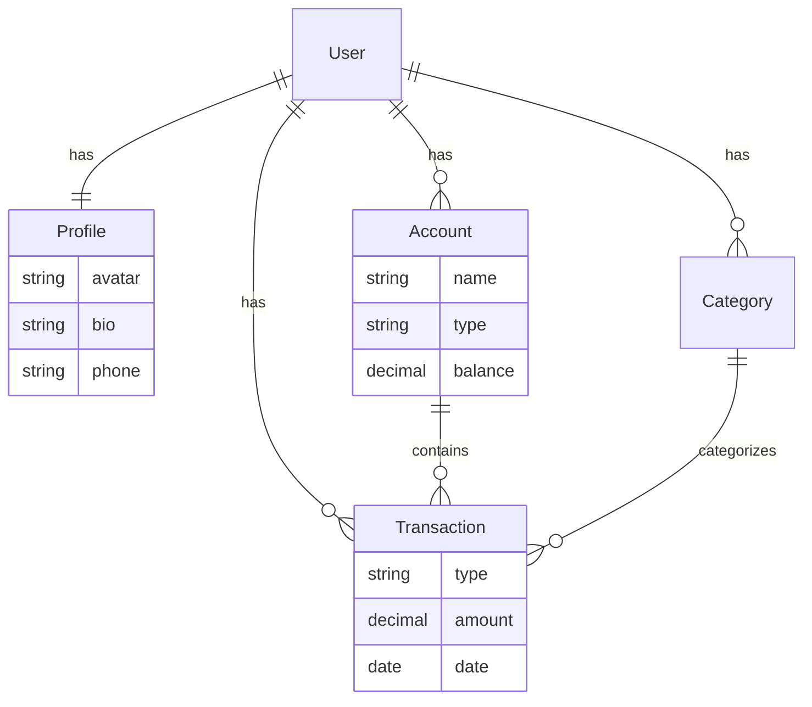

# Banco de Dados

Modelagem de dados do sistema Finanpy.

## Entidades Principais

### User (`users.User`)

Estende `AbstractUser` do Django.

- **email**: Identificador único para login.

### Profile (`profiles.Profile`)

Dados complementares do usuário (1:1 com User).

- **avatar**: Imagem de perfil.
- **bio**: Biografia ou descrição curta.
- **phone**: Telefone de contato.

### Account (`accounts.Account`)

Contas bancárias do usuário.

- **name**: Nome da conta (ex: Nubank, Carteira).
- **type**: Tipo (Corrente, Poupança, Investimento, Dinheiro).
- **balance**: Saldo atual.
- **color**: Cor para identificação visual.

### Category (`categories.Category`)

Classificação das transações.

- **name**: Nome da categoria (ex: Alimentação, Salário).
- **type**: Receita ou Despesa.
- **icon**: Ícone representativo.
- **color**: Cor da categoria.

### Transaction (`transactions.Transaction`)

Registro financeiro.

- **type**: Receita ou Despesa.
- **amount**: Valor da transação.
- **date**: Data de competência.
- **description**: Detalhamento opcional.
- **Relacionamentos**: Pertence a um User, vinculada a uma Account e (opcionalmente) a uma Category.

## Diagrama ER

